Dieses File war ursprünglich ein .docx File

sudo openvpn - -config openvpnfile

Passwort für Tryhackme.com YHLy6Zvb%CQyinF

**Nmap ip | tee nmap-standard** scannt hosts

**Nmap - -script vul -p PORTS IP | tee nmap-vuln** gibt hosts aus, welche hosts wo verwundbar sind

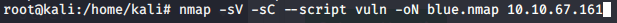

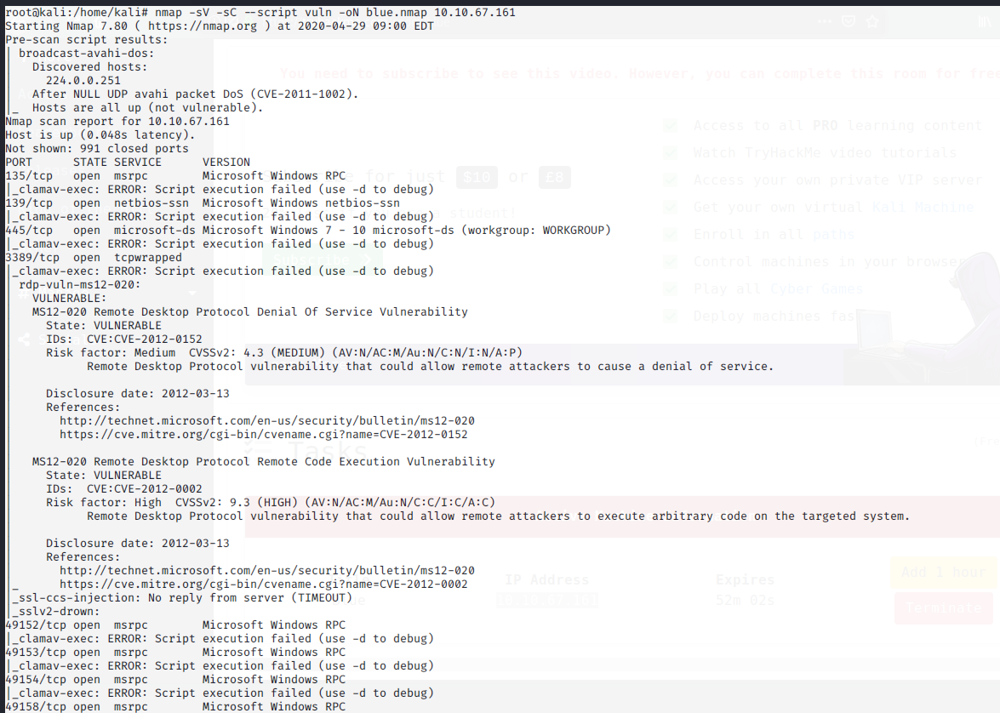

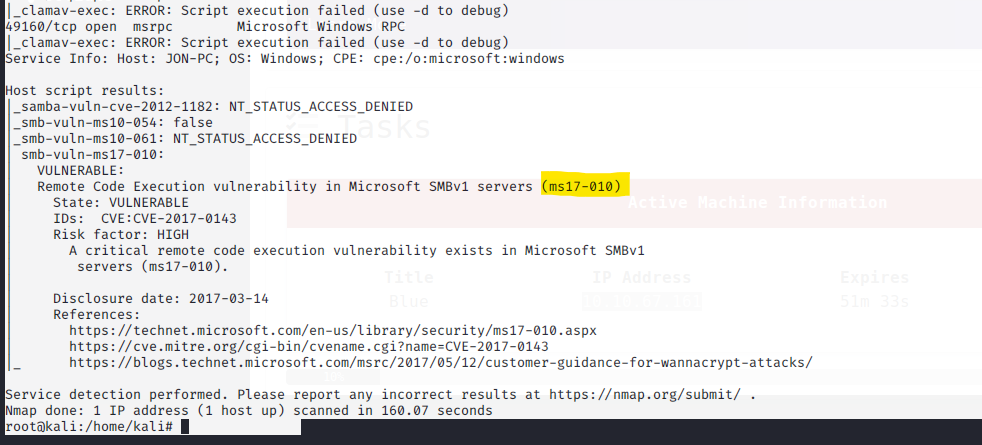

**Mashine is volnerable to ms17-010**

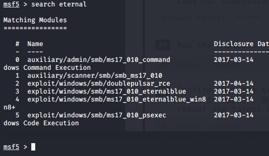

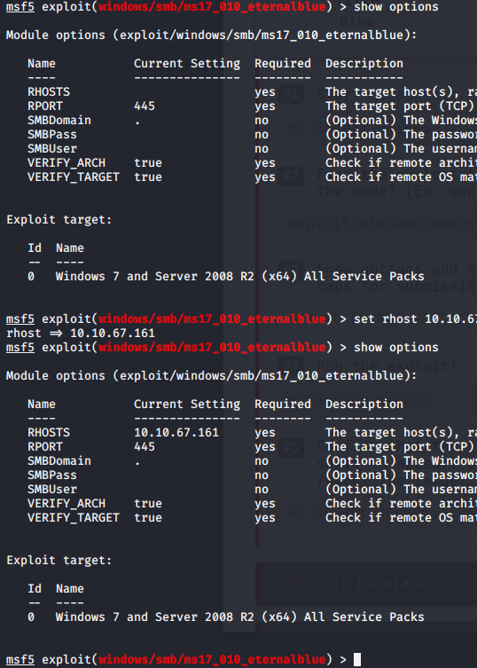

**Rhost – remote host- der host, der angegriffen wird über die vm**

**Nach dem Befehl „run&quot; ist man der Windowsconsole**

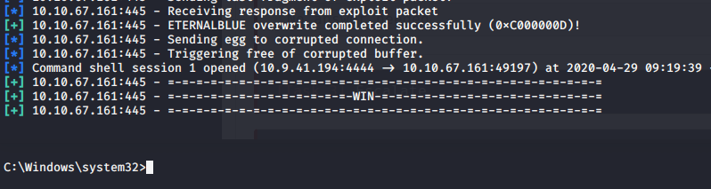

**Nice**

**Mit Controll Z wird Windows in den Hintergrund gegeben**

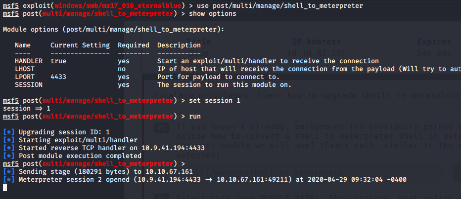

**Session upgraden**

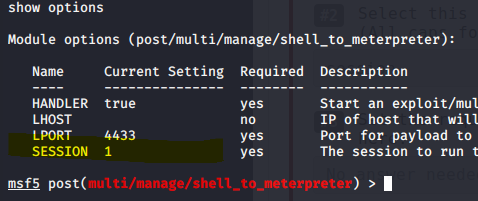

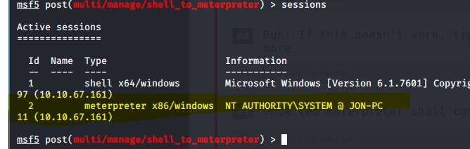

**System ist nun in Session**

**Mit sessions -i 2 kann man mit der session interagieren**

**Mit ps kann man sich alle prozesse anzeigen lassen**

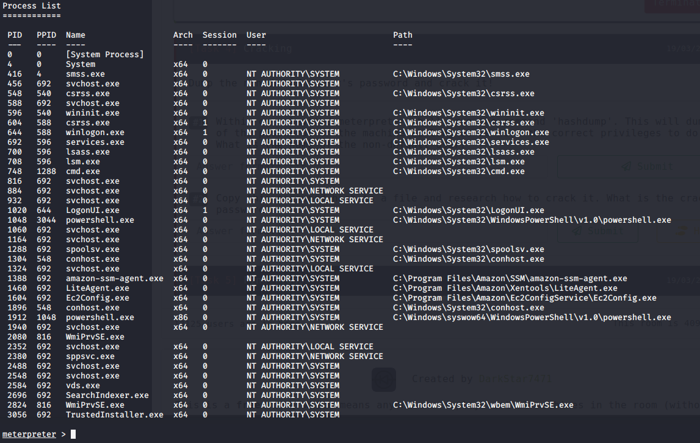

**Prozess 1288 hat richtigen eigenschaften für migrate**

**Mit hashdump werden Passwörter ausgegeben**

**Das Passwort von Jon schreiben wir uns in die datei jon.hash**

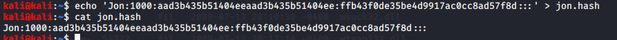

**Mit** **wird der Hash auf klassische Passwörter überprüft. Die Datei mit klassichen Passwörtern heißt rockyou.txt**

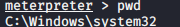